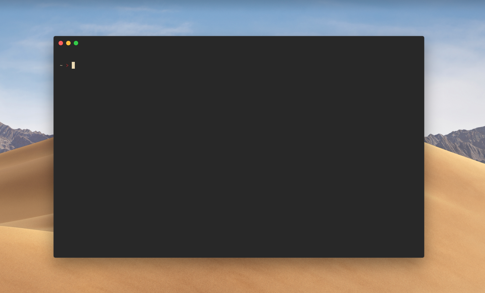

# dotfiles

Config for Neovim 0.5 or higher.

<p align="center">
  
</p>

### Installation

To install these, you'll need either [Neovim](https://neovim.io/) 0.5 prerelease installed on your machine. This can be done by running,

```sh
brew install neovim --HEAD # Installs Neovim 0.5 prerelease.
brew install luajit --HEAD # Install the latest LuaJIT, required for Neovim to work on macOS Catalina.
```
